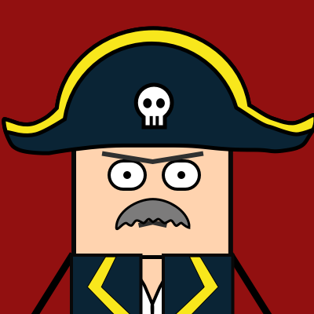
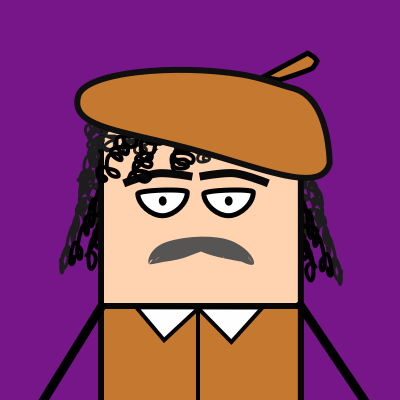
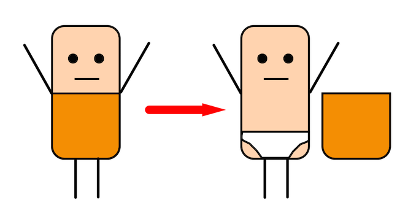

## BigShow

小组成员：

+ WeiZePeng
+ DongYi
+ WeiZeKun
+ WangKongGu

人物形象
--------------------
#### 胶囊人

灵感来源： 快乐氰化物，小黄人。

<!--

-->

#### 人物拆分图:

人物介绍
--------------------
1. B哥   
传说中的人物，你可以在街角的甜甜圈店看到他。

2. 毕加索  
画家，我觉得他应该很有钱。

3. 毕达哥拉斯  
数学家，喜欢给大家出高数题。 

4. 比特曼  
计算机呆子，只是个写程序的。

5. 比克船长  
大名鼎鼎的海洋之灾比克，没听说过么？

[性格特点](./markdown/人物特写.md)

图片设计
--------------------

#### 普通故事  
1 **故事**    

+ 1 彩色人物头像   
+ 1 长条banner封面  
+ 若个 情节
  
1 **情节** 

+ 1 剧情图片 
+ 3 结局图片。

标准尺寸：  

+ 封面尺寸：800 * 450  
+ 头像尺寸：200 * 200  
+ 图片尺寸：640 * 360  

图片比例：

+ 头像 1 : 1   
+ 其他 16 : 9 

100种死法：  
模仿1000种死法的各式各样逗比死法。

故事剧情
--------------------

[B哥的大冒险](./markdown/B哥的正常大冒险.md)

[B哥的跑步比赛](./markdown/B哥的跑步比赛.md)

[比克船长的海上作战](./markdown/比克船长的海上作战.md)

[比特曼](./markdown/比特曼的呆子的一天.md)

[更多剧情](./markdown/人物特写.md)
